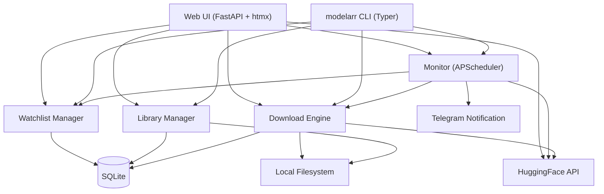

# modelarr - Development Plan

## How to Use This Plan

**For Claude Code**: Read this plan, find the subtask ID from the prompt, complete ALL checkboxes, update completion notes, commit.

**For You**: Use the executor agent to implement subtasks:
```
Use the modelarr-executor agent to execute subtask X.Y.Z
```

## Lessons Learned Safeguards

- **Implicit instructions not repeated per-subtask**: ALL git, verification, and checkpoint commands are explicit in EVERY subtask.
- **TODO stubs**: Verification includes `grep -r "TODO\|FIXME" src/` and must return zero matches.
- **Test mock drift**: Use real Pydantic models or `model_construct()`, never hand-written mock dicts.

---

## Project Overview

**Project Name**: modelarr
**Goal**: Radarr/Sonarr-style tool that monitors HuggingFace for new LLM model releases matching a watchlist and auto-downloads them to a local library
**Timeline**: 1 week

**Architecture:**


**CLI MVP (Complete)**:
- [x] Phase 0: Foundation
- [x] Phase 1: Data Layer (SQLite schema, models, CRUD)
- [x] Phase 2: HuggingFace Client (API integration, model search)
- [x] Phase 3: Download Engine (download, resume, monitoring)
- [x] Phase 4: CLI Interface (Typer commands)
- [x] Phase 5: Notifications (Telegram)
- [x] Phase 6: Storage Management (disk limits, prune)

**Web UI (In Progress)**:
- [ ] Phase 7: Web Foundation (FastAPI app, deps, base template, serve command)
- [ ] Phase 8: Web Core Pages (Dashboard, Watchlist, Library)
- [ ] Phase 9: Web Downloads & Settings (download management, config UI, Telegram test)
- [ ] Phase 10: Web Search & Polish (HuggingFace search, error handling, systemd)

---

## Technology Stack

- **Language**: Python 3.11+
- **CLI Framework**: Typer
- **Web Framework**: FastAPI + Jinja2 + htmx
- **ASGI Server**: uvicorn
- **CSS**: Pico CSS (dark theme, CDN)
- **Interactivity**: htmx (vendored, ~14KB, no build step)
- **Database**: SQLite (via sqlite3 stdlib)
- **HuggingFace**: huggingface_hub
- **Scheduling**: APScheduler (embedded in FastAPI lifespan)
- **Notifications**: httpx (Telegram Bot API direct)
- **Testing**: pytest + pytest-asyncio + httpx (TestClient)
- **Linting**: ruff
- **Type Checking**: mypy
- **Package Management**: uv

---

## Progress Tracking

### Phase 0: Foundation (COMPLETE)
- [x] 0.1.1: Initialize repository and Python project
- [x] 0.1.2: Configure dev tools (ruff, mypy, pytest)

### Phase 1: Data Layer (COMPLETE)
- [x] 1.1.1: SQLite schema and database module
- [x] 1.1.2: Pydantic models for all entities
- [x] 1.1.3: CRUD operations and tests

### Phase 2: HuggingFace Client (COMPLETE)
- [x] 2.1.1: HuggingFace API client
- [x] 2.1.2: Model metadata parser and format detection

### Phase 3: Download Engine & Monitoring (COMPLETE)
- [x] 3.1.1: Download manager with resume support
- [x] 3.1.2: Monitor polling loop with APScheduler

### Phase 4: CLI Interface (COMPLETE)
- [x] 4.1.1: Watchlist CLI commands
- [x] 4.1.2: Library and download CLI commands
- [x] 4.1.3: Monitor CLI commands (start/stop/status)

### Phase 5: Notifications (COMPLETE)
- [x] 5.1.1: Telegram notification module

### Phase 6: Storage Management (COMPLETE)
- [x] 6.1.1: Disk limits and auto-prune

### Phase 7: Web Foundation
- [ ] 7.1.1: Add web dependencies and create package structure
- [ ] 7.1.2: FastAPI app with lifespan, deps, and base template
- [ ] 7.1.3: Add `modelarr serve` CLI command

### Phase 8: Web Core Pages
- [ ] 8.1.1: Dashboard page
- [ ] 8.1.2: Watchlist page with htmx CRUD
- [ ] 8.1.3: Library page with sort/filter/delete

### Phase 9: Web Downloads & Settings
- [ ] 9.1.1: Downloads page with active polling and manual trigger
- [ ] 9.1.2: Settings page with config form and Telegram test

### Phase 10: Web Search & Polish
- [ ] 10.1.1: HuggingFace search page with model detail
- [ ] 10.1.2: Error handling, empty states, and systemd service update

**Current**: Phase 7
**Next**: 7.1.1

---

## Phase 0: Foundation

**Goal**: Python project structure, dev tools, CI
**Duration**: Half day

### Task 0.1: Repository Setup

**Subtask 0.1.1: Initialize Repository and Python Project (Single Session)**

**Prerequisites**: None

**Git**: `git checkout -b feature/0-1-foundation`

**Deliverables**:
- [ ] Create `pyproject.toml` with project metadata, dependencies, and tool config
- [ ] Create `src/modelarr/__init__.py` with `__version__ = "0.1.0"`
- [ ] Create `src/modelarr/__main__.py` for `python -m modelarr` entry
- [ ] Create `src/modelarr/cli.py` with Typer app skeleton (version callback, help text)
- [ ] Create `.gitignore` for Python (venv, __pycache__, .ruff_cache, *.db, dist/)
- [ ] Create `README.md` with project description, architecture diagram, and install instructions
- [x] Create `LICENSE` (Apache-2.0)

**pyproject.toml dependencies**:
```
[project]
dependencies = [
    "typer>=0.12",
    "huggingface-hub>=0.25",
    "apscheduler>=3.10",
    "httpx>=0.27",
    "pydantic>=2.0",
    "rich>=13.0",
]

[project.optional-dependencies]
dev = [
    "pytest>=8.0",
    "pytest-asyncio>=0.23",
    "ruff>=0.5",
    "mypy>=1.10",
]

[project.scripts]
modelarr = "modelarr.cli:app"
```

**Success Criteria**:
- [ ] `uv sync` installs all dependencies
- [ ] `uv run modelarr --version` prints `0.1.0`
- [ ] `uv run modelarr --help` shows help text
- [ ] `.gitignore` includes `__pycache__/`, `.venv/`, `*.db`, `.ruff_cache/`

**Git**: `git add -A && git commit -m "chore: initialize Python project with Typer CLI skeleton [0.1.1]"`

**Completion Notes**: _(filled by executor)_

---

**Subtask 0.1.2: Configure Dev Tools (Single Session)**

**Prerequisites**: 0.1.1 complete

**Deliverables**:
- [ ] Add ruff config to `pyproject.toml` (line-length=100, target=py311, select=["E","F","I","UP","B","SIM"])
- [ ] Add mypy config to `pyproject.toml` (strict=false, warn_return_any=true, warn_unused_configs=true)
- [ ] Add pytest config to `pyproject.toml` (testpaths=["tests"], pythonpath=["src"])
- [ ] Create `tests/__init__.py`
- [ ] Create `tests/test_cli.py` with basic test: CLI shows help, CLI shows version
- [ ] Verify `uv run ruff check src/ tests/` passes
- [ ] Verify `uv run pytest` discovers and passes tests

**Success Criteria**:
- [ ] `uv run ruff check src/ tests/` exits 0
- [ ] `uv run pytest` runs at least 2 tests, all pass
- [ ] `uv run mypy src/` exits without errors

**Git**: `git add -A && git commit -m "chore: configure ruff, mypy, pytest [0.1.2]"`

**Completion Notes**: _(filled by executor)_

---

### Task 0.1 Complete — Squash Merge
- [ ] All subtasks complete
- [ ] All tests pass: `uv run pytest`
- [ ] Lint passes: `uv run ruff check src/ tests/`
- [ ] Squash merge: `git checkout main && git merge --squash feature/0-1-foundation`
- [ ] Commit: `git commit -m "chore: foundation - project structure and dev tools"`
- [ ] Push: `git push origin main`
- [ ] Delete branch: `git branch -d feature/0-1-foundation`

---

## Phase 1: Data Layer

**Goal**: SQLite schema, Pydantic models, CRUD operations
**Duration**: 1 day

### Task 1.1: Database and Models

**Subtask 1.1.1: SQLite Schema and Database Module (Single Session)**

**Prerequisites**: 0.1.2 complete

**Git**: `git checkout main && git pull && git checkout -b feature/1-1-data-layer`

**Deliverables**:
- [ ] Create `src/modelarr/db.py` with:
  - `get_db_path() -> Path` (uses `~/.config/modelarr/modelarr.db`)
  - `init_db(db_path: Path) -> None` (creates tables if not exist)
  - `get_connection(db_path: Path) -> sqlite3.Connection` (row_factory=sqlite3.Row)
- [ ] Schema tables:
  - `watchlist` (id INTEGER PK, type TEXT, value TEXT, filters TEXT JSON, enabled BOOL, created_at TEXT, updated_at TEXT)
  - `models` (id INTEGER PK, repo_id TEXT UNIQUE, author TEXT, name TEXT, format TEXT, quantization TEXT, size_bytes INTEGER, last_commit TEXT, downloaded_at TEXT, local_path TEXT, metadata TEXT JSON)
  - `downloads` (id INTEGER PK, model_id INTEGER FK, status TEXT, started_at TEXT, completed_at TEXT, bytes_downloaded INTEGER, total_bytes INTEGER, error TEXT)
  - `config` (key TEXT PK, value TEXT)
- [ ] Create `tests/test_db.py` with tests for init_db (creates tables), get_connection (returns Row factory)

**Success Criteria**:
- [ ] `init_db()` creates all 4 tables
- [ ] Tables have correct columns verified via `PRAGMA table_info()`
- [ ] `get_connection()` returns Row-factory connection
- [ ] All tests pass

**Git**: `git add -A && git commit -m "feat(db): SQLite schema and database module [1.1.1]"`

**Completion Notes**: _(filled by executor)_

---

**Subtask 1.1.2: Pydantic Models (Single Session)**

**Prerequisites**: 1.1.1 complete

**Deliverables**:
- [ ] Create `src/modelarr/models.py` with Pydantic v2 models:
  - `WatchlistEntry` (id, type: Literal["model","author","query","family"], value, filters: WatchlistFilters, enabled, created_at, updated_at)
  - `WatchlistFilters` (min_size_b: int|None, max_size_b: int|None, formats: list[str]|None, quantizations: list[str]|None)
  - `ModelRecord` (id, repo_id, author, name, format, quantization, size_bytes, last_commit, downloaded_at, local_path, metadata: dict)
  - `DownloadRecord` (id, model_id, status: Literal["queued","downloading","complete","failed","paused"], started_at, completed_at, bytes_downloaded, total_bytes, error)
  - `ModelInfo` (repo_id, author, name, files: list, last_modified, tags, downloads, format, quantization, size_bytes) — from HuggingFace API
- [ ] Create `tests/test_models.py` with validation tests (valid construction, filter defaults, serialization round-trip)

**Success Criteria**:
- [ ] All models construct with valid data
- [ ] WatchlistFilters defaults to all None
- [ ] Models serialize to/from dict correctly
- [ ] Invalid type literals raise ValidationError
- [ ] All tests pass

**Git**: `git add -A && git commit -m "feat(models): Pydantic models for all entities [1.1.2]"`

**Completion Notes**: _(filled by executor)_

---

**Subtask 1.1.3: CRUD Operations (Single Session)**

**Prerequisites**: 1.1.2 complete

**Deliverables**:
- [ ] Create `src/modelarr/store.py` with `ModelarrStore` class:
  - `__init__(self, db_path: Path)` — init db, store connection
  - Watchlist: `add_watch()`, `remove_watch()`, `list_watches()`, `toggle_watch()`, `get_watch()`
  - Models: `upsert_model()`, `get_model_by_repo()`, `list_models()`, `delete_model()`
  - Downloads: `create_download()`, `update_download()`, `get_active_downloads()`, `get_download_history()`
  - Config: `get_config()`, `set_config()`
- [ ] Create `tests/test_store.py` with tests for each CRUD operation (use tmp_path fixture for test DB)

**Success Criteria**:
- [ ] All CRUD operations work with real SQLite (no mocks)
- [ ] `add_watch()` returns the created entry with ID
- [ ] `remove_watch()` deletes and returns True/False
- [ ] `upsert_model()` inserts new or updates existing by repo_id
- [ ] `list_models()` returns list of ModelRecord
- [ ] Tests use `tmp_path` for isolated test databases
- [ ] All tests pass
- [ ] `grep -r "TODO\|FIXME" src/` returns no matches

**Git**: `git add -A && git commit -m "feat(store): CRUD operations for watchlist, models, downloads [1.1.3]"`

**Completion Notes**: _(filled by executor)_

---

### Task 1.1 Complete — Squash Merge
- [ ] All subtasks (1.1.1, 1.1.2, 1.1.3) complete
- [ ] All tests pass: `uv run pytest`
- [ ] Lint passes: `uv run ruff check src/ tests/`
- [ ] Squash merge: `git checkout main && git merge --squash feature/1-1-data-layer`
- [ ] Commit: `git commit -m "feat: data layer - SQLite schema, models, CRUD"`
- [ ] Push: `git push origin main`
- [ ] Delete branch: `git branch -d feature/1-1-data-layer`

---

## Phase 2: HuggingFace Client

**Goal**: API client for searching and fetching model metadata
**Duration**: 1 day

### Task 2.1: HuggingFace Integration

**Subtask 2.1.1: HuggingFace API Client (Single Session)**

**Prerequisites**: 1.1.3 complete

**Git**: `git checkout main && git pull && git checkout -b feature/2-1-hf-client`

**Deliverables**:
- [ ] Create `src/modelarr/hf_client.py` with `HFClient` class:
  - `__init__(self, token: str | None = None)` — uses huggingface_hub `HfApi`
  - `search_models(query: str, author: str | None, sort: str, limit: int) -> list[ModelInfo]` — wraps `list_models()`
  - `get_model_info(repo_id: str) -> ModelInfo` — wraps `model_info()`
  - `get_repo_files(repo_id: str) -> list[dict]` — lists files with sizes
  - `get_latest_commit(repo_id: str) -> str` — returns latest commit SHA
  - `list_author_models(author: str) -> list[ModelInfo]` — all models by an author
- [ ] Detect model format from filenames (*.gguf = GGUF, *.safetensors + config.json with mlx = MLX, etc.)
- [ ] Detect quantization from filename patterns (Q4_K_M, 4bit, 8bit, fp16, bf16)
- [ ] Calculate total model size from file listing
- [ ] Create `tests/test_hf_client.py` with tests using monkeypatched HfApi (no real API calls in tests)

**Success Criteria**:
- [ ] `search_models("opus distilled")` returns list of ModelInfo
- [ ] `get_model_info("mlx-community/some-model")` returns populated ModelInfo
- [ ] Format detection correctly identifies GGUF, MLX, safetensors
- [ ] Quantization detection extracts from filenames
- [ ] All tests pass without making real API calls
- [ ] `grep -r "TODO\|FIXME" src/` returns no matches

**Git**: `git add -A && git commit -m "feat(hf): HuggingFace API client with format/quant detection [2.1.1]"`

**Completion Notes**: _(filled by executor)_

---

**Subtask 2.1.2: Watchlist Matching Engine (Single Session)**

**Prerequisites**: 2.1.1 complete

**Deliverables**:
- [ ] Create `src/modelarr/matcher.py` with `WatchlistMatcher` class:
  - `__init__(self, hf_client: HFClient)`
  - `check_watch(entry: WatchlistEntry) -> list[ModelInfo]` — dispatches by type:
    - type="model": check if repo has new commit since last seen
    - type="author": list author's models, filter by WatchlistFilters, return unseen
    - type="query": search HF, filter by WatchlistFilters, return unseen
    - type="family": search by family name, filter by size/format/quant, return unseen
  - `apply_filters(models: list[ModelInfo], filters: WatchlistFilters) -> list[ModelInfo]`
  - `find_new_models(store: ModelarrStore) -> list[tuple[WatchlistEntry, ModelInfo]]` — check all enabled watches, return new matches
- [ ] Create `tests/test_matcher.py` with tests for each watch type and filter combination

**Success Criteria**:
- [ ] type="model" detects new commits
- [ ] type="author" returns all models by author, filtered
- [ ] Filters correctly exclude by size, format, quantization
- [ ] `find_new_models()` only returns models not already in the store
- [ ] All tests pass

**Git**: `git add -A && git commit -m "feat(matcher): watchlist matching engine with filter support [2.1.2]"`

**Completion Notes**: _(filled by executor)_

---

### Task 2.1 Complete — Squash Merge
- [ ] All subtasks complete
- [ ] All tests pass: `uv run pytest`
- [ ] Squash merge: `git checkout main && git merge --squash feature/2-1-hf-client`
- [ ] Commit: `git commit -m "feat: HuggingFace client and watchlist matching"`
- [ ] Push: `git push origin main`
- [ ] Delete branch: `git branch -d feature/2-1-hf-client`

---

## Phase 3: Download Engine

**Goal**: Download models with resume, organize local library
**Duration**: 1 day

### Task 3.1: Downloads and Library

**Subtask 3.1.1: Download Manager (Single Session)**

**Prerequisites**: 2.1.2 complete

**Git**: `git checkout main && git pull && git checkout -b feature/3-1-downloads`

**Deliverables**:
- [ ] Create `src/modelarr/downloader.py` with `DownloadManager` class:
  - `__init__(self, store: ModelarrStore, library_path: Path, hf_token: str | None)`
  - `download_model(model: ModelInfo, watch: WatchlistEntry | None) -> DownloadRecord`
    - Uses `huggingface_hub.snapshot_download()` with `resume_download=True`
    - Organizes into `library_path / author / model_name /`
    - Creates DownloadRecord, updates status through lifecycle
    - Calculates and stores total size
  - `get_library_size() -> int` — total bytes on disk
  - `list_local_models() -> list[ModelRecord]` — models with local_path set
  - `delete_local_model(repo_id: str) -> bool` — removes files and updates DB
- [ ] Create `tests/test_downloader.py` (mock snapshot_download, test lifecycle tracking, test library size calculation)

**Success Criteria**:
- [ ] `download_model()` creates directory structure under library_path
- [ ] Download status transitions: queued → downloading → complete (or failed)
- [ ] `resume_download=True` passed to snapshot_download
- [ ] `get_library_size()` returns sum of all model sizes
- [ ] `delete_local_model()` removes files and clears local_path in DB
- [ ] All tests pass

**Git**: `git add -A && git commit -m "feat(download): download manager with resume and library tracking [3.1.1]"`

**Completion Notes**: _(filled by executor)_

---

**Subtask 3.1.2: Monitor and Scheduler (Single Session)**

**Prerequisites**: 3.1.1 complete

**Deliverables**:
- [ ] Create `src/modelarr/monitor.py` with `ModelarrMonitor` class:
  - `__init__(self, store, matcher, downloader, notifier, interval_minutes: int = 60)`
  - `check_and_download() -> list[tuple[WatchlistEntry, ModelInfo]]` — single poll cycle:
    1. Call `matcher.find_new_models(store)`
    2. For each new model, call `downloader.download_model()`
    3. For each successful download, call `notifier.notify()` (if configured)
    4. Return list of downloaded models
  - `start()` — starts APScheduler with IntervalTrigger
  - `stop()` — shuts down scheduler
  - `run_once()` — single poll for CLI use
- [ ] Create `tests/test_monitor.py` (mock matcher/downloader/notifier, test poll cycle, test start/stop)

**Success Criteria**:
- [ ] `check_and_download()` finds new models, downloads them, notifies
- [ ] `start()` creates an APScheduler job at configured interval
- [ ] `stop()` cleanly shuts down
- [ ] `run_once()` runs a single cycle and returns
- [ ] All tests pass
- [ ] `grep -r "TODO\|FIXME" src/` returns no matches

**Git**: `git add -A && git commit -m "feat(monitor): polling monitor with APScheduler [3.1.2]"`

**Completion Notes**: _(filled by executor)_

---

### Task 3.1 Complete — Squash Merge
- [ ] All subtasks complete
- [ ] All tests pass: `uv run pytest`
- [ ] Squash merge: `git checkout main && git merge --squash feature/3-1-downloads`
- [ ] Commit: `git commit -m "feat: download engine and monitoring"`
- [ ] Push: `git push origin main`
- [ ] Delete branch: `git branch -d feature/3-1-downloads`

---

## Phase 4: CLI Interface

**Goal**: Full Typer CLI for all operations
**Duration**: 1 day

### Task 4.1: CLI Commands

**Subtask 4.1.1: Watchlist CLI Commands (Single Session)**

**Prerequisites**: 3.1.2 complete

**Git**: `git checkout main && git pull && git checkout -b feature/4-1-cli`

**Deliverables**:
- [ ] Update `src/modelarr/cli.py` with Typer subcommands:
  - `modelarr watch add <type> <value> [--format] [--quant] [--min-size] [--max-size]`
  - `modelarr watch list [--enabled-only]`
  - `modelarr watch remove <id>`
  - `modelarr watch toggle <id>`
- [ ] Use Rich tables for formatted output
- [ ] Create `tests/test_cli_watch.py` using `typer.testing.CliRunner`

**Success Criteria**:
- [ ] `modelarr watch add model mlx-community/Qwen3.5-27B-MLX-4bit` adds entry
- [ ] `modelarr watch add author Jackrong --format mlx --quant 4bit` adds filtered entry
- [ ] `modelarr watch add query "opus distilled" --format gguf` adds search watch
- [ ] `modelarr watch list` shows Rich table with all entries
- [ ] `modelarr watch remove 1` removes entry
- [ ] `modelarr watch toggle 1` enables/disables
- [ ] All tests pass

**Git**: `git add -A && git commit -m "feat(cli): watchlist commands [4.1.1]"`

**Completion Notes**: _(filled by executor)_

---

**Subtask 4.1.2: Library and Download CLI Commands (Single Session)**

**Prerequisites**: 4.1.1 complete

**Deliverables**:
- [ ] Add CLI commands:
  - `modelarr library list [--format] [--sort size|date|name]` — show downloaded models with Rich table
  - `modelarr library size` — total disk usage
  - `modelarr library remove <repo_id>` — delete local model with confirmation
  - `modelarr download <repo_id>` — manual one-off download
  - `modelarr download status` — show active/recent downloads
- [ ] Create `tests/test_cli_library.py`

**Success Criteria**:
- [ ] `modelarr library list` shows models with size, format, date
- [ ] `modelarr library size` shows human-readable total (e.g., "42.3 GB across 5 models")
- [ ] `modelarr download mlx-community/some-model` triggers download
- [ ] All tests pass

**Git**: `git add -A && git commit -m "feat(cli): library and download commands [4.1.2]"`

**Completion Notes**: _(filled by executor)_

---

**Subtask 4.1.3: Monitor CLI Commands (Single Session)**

**Prerequisites**: 4.1.2 complete

**Deliverables**:
- [ ] Add CLI commands:
  - `modelarr monitor start [--interval MINUTES] [--daemon]` — start polling
  - `modelarr monitor stop` — stop polling
  - `modelarr monitor status` — show monitor state and next poll time
  - `modelarr monitor check` — run single poll cycle (alias for run_once)
  - `modelarr config set <key> <value>` — set config (library_path, telegram_token, telegram_chat_id, interval)
  - `modelarr config show` — show all config
- [ ] Create `tests/test_cli_monitor.py`

**Success Criteria**:
- [ ] `modelarr monitor check` runs single poll and reports results
- [ ] `modelarr config set library_path /data/models` stores path
- [ ] `modelarr config show` displays all config as Rich table
- [ ] All tests pass
- [ ] `grep -r "TODO\|FIXME" src/` returns no matches

**Git**: `git add -A && git commit -m "feat(cli): monitor and config commands [4.1.3]"`

**Completion Notes**: _(filled by executor)_

---

### Task 4.1 Complete — Squash Merge
- [ ] All subtasks complete
- [ ] All tests pass: `uv run pytest`
- [ ] Lint passes: `uv run ruff check src/ tests/`
- [ ] Full CLI test: `modelarr --help` shows all command groups
- [ ] Squash merge: `git checkout main && git merge --squash feature/4-1-cli`
- [ ] Commit: `git commit -m "feat: complete CLI interface"`
- [ ] Push: `git push origin main`
- [ ] Delete branch: `git branch -d feature/4-1-cli`

---

## Phase 5: Notifications

**Goal**: Telegram notifications for new downloads
**Duration**: Half day

### Task 5.1: Telegram Integration

**Subtask 5.1.1: Telegram Notification Module (Single Session)**

**Prerequisites**: 4.1.3 complete

**Git**: `git checkout main && git pull && git checkout -b feature/5-1-notifications`

**Deliverables**:
- [ ] Create `src/modelarr/notifier.py` with `TelegramNotifier` class:
  - `__init__(self, bot_token: str, chat_id: str)`
  - `notify(watch: WatchlistEntry, model: ModelInfo, download: DownloadRecord) -> bool`
    - Sends formatted message: model name, author, size, format, quant, download status
    - Uses httpx to POST to `https://api.telegram.org/bot{token}/sendMessage`
    - Returns True on success, False on failure (never raises)
  - `notify_error(error: str) -> bool` — send error notification
  - Class method `from_config(store: ModelarrStore) -> TelegramNotifier | None` — returns None if not configured
- [ ] Create `tests/test_notifier.py` (mock httpx, test message formatting, test graceful failure)

**Success Criteria**:
- [ ] `notify()` sends formatted Telegram message
- [ ] `notify()` returns False on network error, never raises
- [ ] `from_config()` returns None when bot_token or chat_id not set
- [ ] Message includes model name, size (human-readable), format, link to HF page
- [ ] All tests pass

**Git**: `git add -A && git commit -m "feat(notify): Telegram notification module [5.1.1]"`

**Completion Notes**: _(filled by executor)_

---

### Task 5.1 Complete — Squash Merge
- [ ] All subtasks complete
- [ ] All tests pass: `uv run pytest`
- [ ] Squash merge: `git checkout main && git merge --squash feature/5-1-notifications`
- [ ] Commit: `git commit -m "feat: Telegram notifications"`
- [ ] Push: `git push origin main`
- [ ] Delete branch: `git branch -d feature/5-1-notifications`

---

## Phase 6: Storage Management

**Goal**: Disk limits and auto-prune
**Duration**: Half day

### Task 6.1: Storage Controls

**Subtask 6.1.1: Disk Limits and Auto-Prune (Single Session)**

**Prerequisites**: 5.1.1 complete

**Git**: `git checkout main && git pull && git checkout -b feature/6-1-storage`

**Deliverables**:
- [ ] Create `src/modelarr/storage.py` with `StorageManager` class:
  - `__init__(self, store: ModelarrStore, library_path: Path, max_bytes: int | None)`
  - `check_space(required_bytes: int) -> bool` — returns True if download would fit within limit
  - `prune_oldest(required_bytes: int) -> list[ModelRecord]` — delete oldest models until enough space, return deleted
  - `get_usage() -> dict` — {total_bytes, model_count, max_bytes, free_bytes}
- [ ] Wire into DownloadManager: before downloading, check space; if over limit and auto_prune enabled, prune oldest
- [ ] Add CLI: `modelarr config set max_storage_gb <N>` and `modelarr config set auto_prune <true|false>`
- [ ] Create `tests/test_storage.py`

**Success Criteria**:
- [ ] `check_space()` correctly compares against max_bytes
- [ ] `prune_oldest()` deletes oldest models by downloaded_at until enough space freed
- [ ] Download aborted (not pruned) if auto_prune is disabled and over limit
- [ ] All tests pass
- [ ] `grep -r "TODO\|FIXME" src/` returns no matches

**Git**: `git add -A && git commit -m "feat(storage): disk limits and auto-prune [6.1.1]"`

**Completion Notes**: _(filled by executor)_

---

### Task 6.1 Complete — Squash Merge
- [ ] All subtasks complete
- [ ] All tests pass: `uv run pytest`
- [ ] Squash merge: `git checkout main && git merge --squash feature/6-1-storage`
- [ ] Commit: `git commit -m "feat: storage management with disk limits and auto-prune"`
- [ ] Push: `git push origin main`
- [ ] Delete branch: `git branch -d feature/6-1-storage`

---

## Phase 7: Web Foundation

**Goal**: FastAPI app skeleton, dependency injection, base template, `serve` command
**Duration**: 1 day

### Task 7.1: Web Package Setup

**Subtask 7.1.1: Add Web Dependencies and Create Package Structure (Single Session)**

**Prerequisites**: Phase 6 complete (all CLI features working)

**Git**: `git checkout main && git pull && git checkout -b feature/7-1-web-foundation`

**Deliverables**:
- [ ] Replace the `dependencies` list in `pyproject.toml` with:
  ```toml
  dependencies = [
      "typer>=0.12",
      "huggingface-hub>=0.25",
      "apscheduler>=3.10",
      "httpx>=0.27",
      "pydantic>=2.0",
      "rich>=13.0",
      "fastapi>=0.115",
      "uvicorn[standard]>=0.32",
      "jinja2>=3.1",
  ]
  ```
- [ ] Run `uv sync` to install new dependencies
- [ ] Create directory structure:
  ```
  src/modelarr/web/
  ├── __init__.py
  ├── app.py
  ├── deps.py
  ├── routes/
  │   └── __init__.py
  ├── templates/
  │   └── base.html
  └── static/
      ├── htmx.min.js  (vendored from unpkg.com/htmx.org@2.0.4)
      └── style.css
  ```
- [ ] In `src/modelarr/db.py`, update `get_connection()` to set busy_timeout after creating the connection:
  ```python
  def get_connection(db_path: Path) -> sqlite3.Connection:
      """Get a SQLite connection with Row factory."""
      conn = sqlite3.connect(str(db_path))
      conn.row_factory = sqlite3.Row
      conn.execute("PRAGMA busy_timeout = 5000")
      return conn
  ```

**Success Criteria**:
- [ ] `uv sync` installs fastapi, uvicorn, jinja2
- [ ] All existing 194 tests still pass
- [ ] Directory structure exists with `__init__.py` files

**Git**: `git add -A && git commit -m "chore(web): add web dependencies and package structure [7.1.1]"`

**Completion Notes**: _(filled by executor)_

---

**Subtask 7.1.2: FastAPI App with Lifespan, Deps, and Base Template (Single Session)**

**Prerequisites**: 7.1.1 complete

**Deliverables**:
- [ ] Create `src/modelarr/web/app.py` with:
  - `create_app() -> FastAPI` factory function
  - `lifespan` async context manager that starts/stops `ModelarrMonitor` via APScheduler
  - Mount static files at `/static`
  - Configure Jinja2 templates directory
  - Include all route routers (dashboard, watchlist, library, downloads, settings, search)
- [ ] Create `src/modelarr/web/deps.py` with FastAPI dependency functions:
  - `get_store() -> ModelarrStore`
  - `get_downloader(store) -> DownloadManager`
  - `get_hf_client(store) -> HFClient`
  - `get_storage_manager(store) -> StorageManager | None`
  - `format_bytes(bytes_: int | None) -> str` (reuse logic from cli.py)
- [ ] Create `src/modelarr/web/templates/base.html`:
  - HTML5 document with Pico CSS (CDN) and `data-theme="dark"`
  - Vendored htmx.min.js script tag
  - Navigation: Dashboard, Watchlist, Library, Downloads, Settings, Search
  - Content block for child templates
  - Footer with modelarr version
- [ ] Create `src/modelarr/web/static/style.css` with custom overrides
- [ ] Create `tests/test_web_app.py` with basic tests:
  - App creates successfully
  - Static files mounted
  - Health check endpoint works

**Success Criteria**:
- [ ] `create_app()` returns a FastAPI instance
- [ ] Lifespan starts and stops monitor without error
- [ ] Templates render with Pico dark theme
- [ ] All tests pass (new + existing)

**Git**: `git add -A && git commit -m "feat(web): FastAPI app with lifespan, deps, and base template [7.1.2]"`

**Completion Notes**: _(filled by executor)_

---

**Subtask 7.1.3: Add `modelarr serve` CLI Command (Single Session)**

**Prerequisites**: 7.1.2 complete

**Deliverables**:
- [ ] Add `serve` command to `src/modelarr/cli.py`:
  ```python
  @app.command()
  def serve(
      host: str = typer.Option("0.0.0.0", help="Bind address"),
      port: int = typer.Option(8585, help="Port"),
      interval: int = typer.Option(60, "--interval", "-i", help="Monitor poll interval in minutes"),
  ):
      """Start the web UI with embedded monitor."""
  ```
  - Imports and calls `uvicorn.run()` with `create_app()`
  - Stores interval in config before starting
- [ ] Create `tests/test_cli_serve.py` with test that `modelarr serve --help` works
- [ ] Verify `modelarr --help` shows the new `serve` command

**Success Criteria**:
- [ ] `modelarr serve --help` shows host, port, interval options
- [ ] `modelarr --help` lists `serve` alongside other commands
- [ ] All tests pass
- [ ] `uv run ruff check src/ tests/` passes
- [ ] `uv run mypy src/` passes

**Git**: `git add -A && git commit -m "feat(cli): add serve command for web UI [7.1.3]"`

**Completion Notes**: _(filled by executor)_

---

### Task 7.1 Complete — Squash Merge
- [ ] All subtasks (7.1.1, 7.1.2, 7.1.3) complete
- [ ] All tests pass: `uv run pytest`
- [ ] Lint passes: `uv run ruff check src/ tests/`
- [ ] `modelarr serve` starts on port 8585 and serves base template
- [ ] Squash merge: `git checkout main && git merge --squash feature/7-1-web-foundation`
- [ ] Commit: `git commit -m "feat: web foundation - FastAPI app, deps, base template, serve command"`
- [ ] Push: `git push origin main`
- [ ] Delete branch: `git branch -d feature/7-1-web-foundation`

---

## Phase 8: Web Core Pages

**Goal**: Dashboard, Watchlist, and Library pages
**Duration**: 2 days

### Task 8.1: Core Pages

**Subtask 8.1.1: Dashboard Page (Single Session)**

**Prerequisites**: 7.1.3 complete

**Git**: `git checkout main && git pull && git checkout -b feature/8-1-core-pages`

**Deliverables**:
- [ ] Create `src/modelarr/web/routes/dashboard.py` with:
  - `GET /` — renders dashboard with:
    - Monitor status (running/stopped, poll interval, enabled watch count)
    - Library stats (model count, total size, storage limit, usage percentage)
    - Active downloads (if any, with status)
    - Recent activity (last 5 completed/failed downloads)
    - Quick actions: "Run Check Now" button (POST /dashboard/check), "Start/Stop Monitor" button
  - `POST /dashboard/check` — triggers `monitor.run_once()`, returns htmx partial with results
- [ ] Create `src/modelarr/web/templates/dashboard.html`
- [ ] Create `src/modelarr/web/templates/partials/toast.html` for success/error notifications
- [ ] Create `tests/test_web_dashboard.py` (use httpx TestClient)

**Success Criteria**:
- [ ] Dashboard loads at `/` with all stat cards
- [ ] "Run Check Now" triggers poll and shows result via htmx
- [ ] All tests pass

**Git**: `git add -A && git commit -m "feat(web): dashboard page with stats and quick actions [8.1.1]"`

**Completion Notes**: _(filled by executor)_

---

**Subtask 8.1.2: Watchlist Page with htmx CRUD (Single Session)**

**Prerequisites**: 8.1.1 complete

**Deliverables**:
- [ ] Create `src/modelarr/web/routes/watchlist.py` with:
  - `GET /watchlist` — renders full watchlist table
  - `POST /watchlist` — add new watch (form submission), returns htmx partial to append row
  - `DELETE /watchlist/{id}` — remove watch, returns empty (htmx swap delete)
  - `PATCH /watchlist/{id}/toggle` — toggle enabled, returns updated row partial
- [ ] Create `src/modelarr/web/templates/watchlist.html`:
  - Table: ID, Type, Value, Filters, Enabled (toggle switch), Actions (delete)
  - Add form: type dropdown (model/author/query/family), value input, format filter, quant filter, size filters
  - All mutations via htmx (no full page reload)
- [ ] Create `src/modelarr/web/templates/partials/watch_row.html`
- [ ] Create `src/modelarr/web/templates/partials/watch_form.html`
- [ ] Create `tests/test_web_watchlist.py`

**Success Criteria**:
- [ ] Watchlist table shows all watches with filters
- [ ] Add form creates watch and inserts row via htmx
- [ ] Toggle switch enables/disables without page reload
- [ ] Delete button removes row via htmx
- [ ] All tests pass

**Git**: `git add -A && git commit -m "feat(web): watchlist page with htmx CRUD [8.1.2]"`

**Completion Notes**: _(filled by executor)_

---

**Subtask 8.1.3: Library Page with Sort/Filter/Delete (Single Session)**

**Prerequisites**: 8.1.2 complete

**Deliverables**:
- [ ] Create `src/modelarr/web/routes/library.py` with:
  - `GET /library` — renders model table with query params: `?sort=date|size|name&format=mlx|gguf`
  - `DELETE /library/{repo_id}` — delete model from disk and DB, returns htmx swap
  - `GET /library/size` — returns total size as htmx partial (for header)
- [ ] Create `src/modelarr/web/templates/library.html`:
  - Header: total size, model count, storage usage bar (if limit set)
  - Sort controls (htmx links that swap table body)
  - Format filter dropdown
  - Table: Repo ID (link to HF), Author, Format, Quantization, Size, Downloaded date, Delete button
- [ ] Create `src/modelarr/web/templates/partials/model_row.html`
- [ ] Create `tests/test_web_library.py`

**Success Criteria**:
- [ ] Library table shows all downloaded models
- [ ] Sort by date/size/name works via htmx
- [ ] Format filter narrows results
- [ ] Delete removes model from disk and table row
- [ ] All tests pass

**Git**: `git add -A && git commit -m "feat(web): library page with sort, filter, and delete [8.1.3]"`

**Completion Notes**: _(filled by executor)_

---

### Task 8.1 Complete — Squash Merge
- [ ] All subtasks (8.1.1, 8.1.2, 8.1.3) complete
- [ ] All tests pass: `uv run pytest`
- [ ] Lint passes: `uv run ruff check src/ tests/`
- [ ] All three pages render correctly in browser
- [ ] Squash merge: `git checkout main && git merge --squash feature/8-1-core-pages`
- [ ] Commit: `git commit -m "feat: web core pages - dashboard, watchlist, library"`
- [ ] Push: `git push origin main`
- [ ] Delete branch: `git branch -d feature/8-1-core-pages`

---

## Phase 9: Web Downloads & Settings

**Goal**: Download management and settings pages
**Duration**: 1 day

### Task 9.1: Downloads and Settings

**Subtask 9.1.1: Downloads Page with Active Polling and Manual Trigger (Single Session)**

**Prerequisites**: 8.1.3 complete

**Git**: `git checkout main && git pull && git checkout -b feature/9-1-downloads-settings`

**Deliverables**:
- [ ] Create `src/modelarr/web/routes/downloads.py` with:
  - `GET /downloads` — renders downloads page with active + history sections
  - `GET /downloads/active` — htmx partial returning active download rows (polled every 5s)
  - `POST /downloads` — manual download by repo_id, dispatches to APScheduler thread pool, returns queued status
- [ ] Create `src/modelarr/web/templates/downloads.html`:
  - Active downloads section with progress bars (htmx polls `/downloads/active` every 5s via `hx-trigger="every 5s"`)
  - Manual download form: repo_id input + submit button
  - History table: last 20 completed/failed downloads with status badge, size, timestamps, error message
- [ ] Create `src/modelarr/web/templates/partials/download_row.html`
- [ ] Create `src/modelarr/web/templates/partials/active_downloads.html`
- [ ] Create `tests/test_web_downloads.py`

**Success Criteria**:
- [ ] Active downloads show with progress bars
- [ ] Active section auto-refreshes every 5 seconds
- [ ] Manual download form dispatches download and shows queued status
- [ ] History shows completed/failed downloads
- [ ] All tests pass

**Git**: `git add -A && git commit -m "feat(web): downloads page with active polling and manual trigger [9.1.1]"`

**Completion Notes**: _(filled by executor)_

---

**Subtask 9.1.2: Settings Page with Config Form and Telegram Test (Single Session)**

**Prerequisites**: 9.1.1 complete

**Deliverables**:
- [ ] Create `src/modelarr/web/routes/settings.py` with:
  - `GET /settings` — renders config form with current values
  - `POST /settings` — save all config values, return toast confirmation
  - `POST /settings/telegram-test` — send test Telegram notification, return success/failure toast
- [ ] Create `src/modelarr/web/templates/settings.html`:
  - Form fields for all config keys:
    - `library_path` (text input)
    - `max_storage_gb` (number input)
    - `storage_auto_prune` (checkbox)
    - `interval_minutes` (number input)
    - `huggingface_token` (password input)
    - `telegram_bot_token` (password input)
    - `telegram_chat_id` (text input)
  - Save button (htmx POST)
  - "Test Telegram" button (htmx POST, shows toast)
- [ ] Create `tests/test_web_settings.py`

**Success Criteria**:
- [ ] Settings form loads with current config values
- [ ] Save persists all values to SQLite config table
- [ ] "Test Telegram" sends a test message and shows result
- [ ] Sensitive fields (tokens) display as password inputs
- [ ] All tests pass
- [ ] `grep -r "TODO\|FIXME" src/` returns no matches

**Git**: `git add -A && git commit -m "feat(web): settings page with config form and Telegram test [9.1.2]"`

**Completion Notes**: _(filled by executor)_

---

### Task 9.1 Complete — Squash Merge
- [ ] All subtasks (9.1.1, 9.1.2) complete
- [ ] All tests pass: `uv run pytest`
- [ ] Lint passes: `uv run ruff check src/ tests/`
- [ ] Squash merge: `git checkout main && git merge --squash feature/9-1-downloads-settings`
- [ ] Commit: `git commit -m "feat: web downloads and settings pages"`
- [ ] Push: `git push origin main`
- [ ] Delete branch: `git branch -d feature/9-1-downloads-settings`

---

## Phase 10: Web Search & Polish

**Goal**: HuggingFace search page, error handling, systemd deployment
**Duration**: 1 day

### Task 10.1: Search and Polish

**Subtask 10.1.1: HuggingFace Search Page with Model Detail (Single Session)**

**Prerequisites**: 9.1.2 complete

**Git**: `git checkout main && git pull && git checkout -b feature/10-1-search-polish`

**Deliverables**:
- [ ] Create `src/modelarr/web/routes/search.py` with:
  - `GET /search` — renders search page with optional `?q=` query param
  - `GET /search/results` — htmx partial returning search result cards (triggered by search input)
  - `GET /search/model/{repo_id}` — model detail panel (files, tags, metadata)
  - `POST /search/watch` — add model/author to watchlist from search results
  - `POST /search/download` — trigger immediate download from search results
- [ ] Create `src/modelarr/web/templates/search.html`:
  - Search input with htmx debounce (`hx-trigger="keyup changed delay:500ms"`)
  - Result cards: repo_id, author, size, format, quantization, download count, HF link
  - Each card: "Add to Watchlist" and "Download Now" buttons
  - Model detail expansion (click to reveal files, tags)
- [ ] Create `src/modelarr/web/templates/partials/search_results.html`
- [ ] Create `tests/test_web_search.py`

**Success Criteria**:
- [ ] Search input queries HuggingFace API with debounce
- [ ] Result cards show model metadata
- [ ] "Add to Watchlist" creates watch entry
- [ ] "Download Now" triggers background download
- [ ] All tests pass

**Git**: `git add -A && git commit -m "feat(web): HuggingFace search page with model detail [10.1.1]"`

**Completion Notes**: _(filled by executor)_

---

**Subtask 10.1.2: Error Handling, Empty States, and systemd Service Update (Single Session)**

**Prerequisites**: 10.1.1 complete

**Deliverables**:
- [ ] Add error handling:
  - 404 page template
  - 500 error handler with user-friendly message
  - htmx error swap targets (show toast on failed requests)
- [ ] Add empty states to all pages:
  - Watchlist: "No watches yet. Add one to start monitoring."
  - Library: "No models downloaded yet."
  - Downloads: "No active or recent downloads."
  - Search: "Search HuggingFace for LLM models."
- [ ] Update navigation to highlight active page
- [ ] Update README.md with web UI documentation and screenshots section
- [ ] Document systemd service update for oldassmini-0:
  ```ini
  ExecStart=/home/mike/modelarr/.venv/bin/modelarr serve --port 8585 --interval 60
  ```
- [ ] Final verification:
  - [ ] `uv run ruff check src/ tests/`
  - [ ] `uv run mypy src/`
  - [ ] `uv run pytest` — all tests pass
  - [ ] `grep -r "TODO\|FIXME" src/` returns no matches
  - [ ] All 6 pages load and function correctly

**Success Criteria**:
- [ ] Error pages render cleanly
- [ ] Empty states guide user to next action
- [ ] All pages work end-to-end
- [ ] README documents web UI usage
- [ ] All tests pass
- [ ] Lint and type check clean

**Git**: `git add -A && git commit -m "feat(web): error handling, empty states, and polish [10.1.2]"`

**Completion Notes**: _(filled by executor)_

---

### Task 10.1 Complete — Squash Merge
- [ ] All subtasks (10.1.1, 10.1.2) complete
- [ ] All tests pass: `uv run pytest`
- [ ] Lint passes: `uv run ruff check src/ tests/`
- [ ] Type check passes: `uv run mypy src/`
- [ ] All 6 web pages functional
- [ ] Squash merge: `git checkout main && git merge --squash feature/10-1-search-polish`
- [ ] Commit: `git commit -m "feat: web search page and polish"`
- [ ] Push: `git push origin main`
- [ ] Delete branch: `git branch -d feature/10-1-search-polish`

---

## v2 Roadmap (Post Web UI)

- **v2.1**: Weekly digest notification
- **v2.2**: Quick-launch integration (mlx_lm.chat, ollama)
- **v2.3**: Model comparison view
- **v2.4**: RSS/Atom feed of new downloads
- **v2.5**: Ollama modelfile auto-generation
- **v2.6**: Docker/LXC deployment for Proxmox

---

## Git Workflow

### Branch Strategy
- **ONE branch per TASK** (e.g., `feature/1-1-data-layer`)
- Subtasks are commits within the task branch
- Branch naming: `feature/{phase}-{task}-{description}`

### Commit Strategy
- One commit per subtask: `feat(scope): description [X.Y.Z]`
- Types: `feat`, `fix`, `refactor`, `test`, `docs`, `chore`

### Merge Strategy
- Squash merge when task is complete
- Delete feature branch after merge

---

*Generated by DevPlan MCP Server — Enhanced for modelarr*
