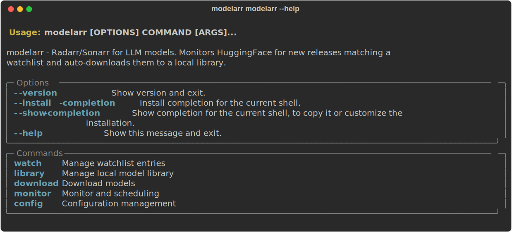
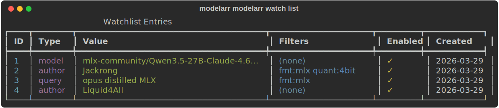
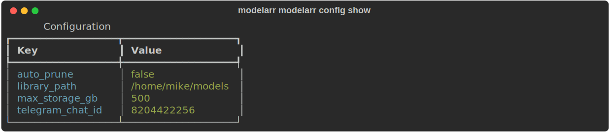
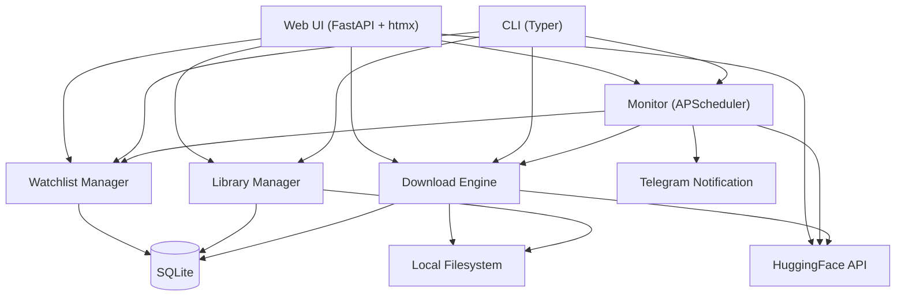

# modelarr

[](https://github.com/mmorris35/modelarr/actions/workflows/ci.yml)

**Radarr/Sonarr for LLM models.** Monitors HuggingFace for new releases matching your watchlist and auto-downloads them to a local library.

---

## Why modelarr?

New open-weight models drop daily. The good ones get gated, relicensed, or quietly removed without warning. If you're running local inference — whether on a Mac Mini, a homelab server, or an air-gapped workstation — you need the models *before* you need them.

modelarr watches HuggingFace so you don't have to. Tell it what you care about (an author, a model family, a search query), and it handles the rest: polling for new releases, filtering by format and quantization, downloading to your local library, and notifying you when something lands.

**Who is this for?**

- **Local inference operators** — You run Ollama, llama.cpp, mlx_lm, or vLLM and want new GGUF/MLX models ready without manual hunting
- **Model collectors** — You maintain a curated library across formats and quantizations and want it to grow automatically
- **Sovereign AI builders** — You believe model access shouldn't depend on the political climate, a cloud provider's terms of service, or whether someone decides open weights are too dangerous. You want local copies, on your hardware, under your control
- **Homelab enthusiasts** — You already run Radarr and Sonarr. This is the same idea for LLMs: watchlist, auto-download, web UI, notifications

**What problems does it solve?**

- Models you want get released while you sleep — modelarr catches them
- Models get taken down or gated after release — you already have them
- Manually checking HuggingFace is tedious — modelarr polls on a schedule
- Downloading 50GB models by hand is error-prone — modelarr streams with resume support
- You forget what you've downloaded — modelarr tracks your library with format, quantization, and disk usage



---

## Features

- **Smart Watchlist** — Follow specific models, authors, search queries, or model families with format/quantization filters
- **Auto-Download** — Streaming downloads in 1MB chunks with resume support — safe on low-RAM hardware
- **Web UI** — Dark-themed dashboard with htmx for managing watches, browsing your library, triggering downloads, and searching HuggingFace
- **Format Detection** — Automatically identifies GGUF, MLX, safetensors, and PyTorch formats from filenames
- **Quantization Detection** — Extracts quantization level (Q4_K_M, 4bit, 8bit, fp16, bf16) from filenames
- **Storage Management** — Set disk limits and auto-prune oldest models when space runs low
- **Telegram Notifications** — Get pinged when new models are downloaded
- **Scheduled Monitoring** — Runs on a configurable interval with embedded scheduler
- **Low-RAM Safe** — Configurable memory guard and single-file streaming — runs on a Core2Duo with 1.7GB RAM alongside other services
- **Local-First** — Everything stored in SQLite at `~/.config/modelarr/`. No cloud dependencies beyond HuggingFace.

---

## Installation

**Requirements:** Python 3.11+ and [uv](https://docs.astral.sh/uv/)

```bash
git clone https://github.com/mmorris35/modelarr.git
cd modelarr
uv sync
```

Verify:
```bash
uv run modelarr --version
# modelarr 0.2.0
```

---

## Quick Start

### 1. Run the setup wizard

```bash
modelarr init
```

This walks you through: library path, storage limits, HuggingFace token, Telegram notifications, poll interval, and download safety settings.

### 2. Add watches

```bash
# Watch a specific model for updates
modelarr watch add model mlx-community/Qwen3.5-27B-Claude-4.6-Opus-Distilled-MLX-4bit

# Watch everything an author releases, filtered to GGUF
modelarr watch add author bartowski --format gguf

# Watch a search query
modelarr watch add query "opus distilled MLX" --format mlx

# Watch a model family
modelarr watch add family Qwen3.5 --quant 4bit
```

### 3. Start the web UI

```bash
modelarr serve
```

Open `http://localhost:8585` in your browser. The web UI includes a dashboard, watchlist manager, library browser, download manager, settings page, and HuggingFace search.

Or use the CLI only:

```bash
# One-off check
modelarr monitor check

# Start the headless scheduler
modelarr monitor start --daemon
```

---

## Web UI

The web UI runs on port 8585 and embeds the monitor scheduler in the same process. Dark theme via Pico CSS, interactive updates via htmx — no JavaScript build step required.

```bash
modelarr serve                          # Start on default port 8585
modelarr serve --port 9090              # Custom port
modelarr serve --interval 30            # Poll every 30 minutes
```

### Pages

| Page | URL | What it does |
|------|-----|-------------|
| **Dashboard** | `/` | Monitor status, library stats, active downloads, recent activity, quick actions |
| **Watchlist** | `/watchlist` | Add/remove/toggle watches with filters — all inline via htmx |
| **Library** | `/library` | Browse downloaded models, sort by date/size/name, filter by format, delete |
| **Downloads** | `/downloads` | Active downloads with live progress, download history, manual download form |
| **Settings** | `/settings` | All config in one form, Telegram test button |
| **Search** | `/search` | Search HuggingFace with debounced input, add to watchlist or download directly |

---

## Watchlist



### Watch Types

| Type | What it does | Example |
|------|-------------|---------|
| `model` | Tracks a specific model repo for new commits | `modelarr watch add model mlx-community/Qwen3.5-27B-MLX-4bit` |
| `author` | Tracks all models by an author | `modelarr watch add author Jackrong --format gguf` |
| `query` | Searches HuggingFace for matching models | `modelarr watch add query "opus distilled" --format gguf` |
| `family` | Tracks a model family by name | `modelarr watch add family Qwen3.5 --quant 4bit` |

### Filters

All watch types support optional filters:

```bash
--format mlx          # Only MLX format models
--format gguf         # Only GGUF format models
--quant 4bit          # Only 4-bit quantized models
--quant Q4_K_M        # Specific quantization variant
--min-size 1000000    # Minimum size in bytes
--max-size 50000000000 # Maximum size in bytes
```

### Managing Watches

```bash
modelarr watch list              # Show all watches
modelarr watch list --enabled-only  # Show only enabled watches
modelarr watch toggle 2          # Disable/enable watch #2
modelarr watch remove 3          # Delete watch #3
```

---

## Library Management

```bash
# List all downloaded models
modelarr library list

# Show total disk usage
modelarr library size

# Remove a downloaded model
modelarr library remove mlx-community/Qwen3.5-27B-MLX-4bit

# Manual one-off download (bypasses watchlist)
modelarr download mlx-community/some-model

# Show download status
modelarr download status
```

---

## Monitor

```bash
# Single poll cycle
modelarr monitor check

# Start background scheduler (default: every 60 minutes)
modelarr monitor start
modelarr monitor start --interval 30    # Poll every 30 minutes
modelarr monitor start --daemon         # Run in background

# Check if monitor is running
modelarr monitor status

# Stop background monitor
modelarr monitor stop
```

---

## Configuration



```bash
modelarr config set <key> <value>
modelarr config show
```

| Key | Description | Default |
|-----|-------------|---------|
| `library_path` | Where to store downloaded models | `~/.modelarr/library` |
| `interval_minutes` | Poll interval in minutes | `60` |
| `max_storage_gb` | Maximum disk usage in GB | _(unlimited)_ |
| `storage_auto_prune` | Auto-delete oldest models when over limit | `false` |
| `max_download_workers` | Parallel file downloads per model (1 = safest) | `1` |
| `min_free_memory_mb` | Refuse downloads below this free RAM (0 = disable) | `200` |
| `huggingface_token` | HuggingFace API token for private/gated models | _(none)_ |
| `telegram_bot_token` | Telegram Bot API token | _(none)_ |
| `telegram_chat_id` | Telegram chat ID for notifications | _(none)_ |
| `ollama_host` | Ollama API endpoint for model push | _(none)_ |
| `digest_enabled` | Enable weekly Telegram digest | `false` |
| `digest_day` | Day of week for digest (monday-sunday) | `monday` |
| `digest_hour` | Hour of day for digest (0-23) | `9` |

All config stored in SQLite at `~/.config/modelarr/modelarr.db`. Edit via CLI, web UI settings page, or the `modelarr init` setup wizard.

---

## Deployment

### systemd (recommended for always-on servers)

```ini
[Unit]
Description=modelarr - LLM Model Monitor Web UI
After=network-online.target remote-fs.target
Requires=remote-fs.target
Wants=network-online.target

[Service]
Type=simple
User=mike
Group=mike
WorkingDirectory=/path/to/modelarr
ExecStart=/path/to/modelarr/.venv/bin/modelarr serve --port 8585 --interval 60
Restart=on-failure
RestartSec=30

[Install]
WantedBy=multi-user.target
```

```bash
sudo systemctl daemon-reload
sudo systemctl enable --now modelarr
```

### Resource Requirements

| | Minimum | Recommended |
|---|---------|-------------|
| **CPU** | Any (tested on Core2Duo) | 2+ cores |
| **RAM** | 1.5 GB (with other services) | 4+ GB |
| **Disk** | Depends on model collection | NAS or large SSD |
| **Python** | 3.11+ | 3.12+ |

modelarr itself uses ~55MB RAM. Downloads stream to disk in 1MB chunks regardless of model size.

---

## Architecture



### How Downloads Work

Files are downloaded one at a time via streaming HTTP in 1MB chunks. This keeps memory usage constant regardless of model size — a 50GB GGUF file uses the same ~55MB RSS as a 50KB config file. Progress is tracked per-file and updated in the database every 10MB, visible in real-time on the web UI.

### How the Monitor Works

```
Every N minutes:
  1. Load all enabled watchlist entries
  2. For each watch, query HuggingFace API
  3. Apply filters (format, quantization, size)
  4. Compare against known models in DB
  5. Download new matches via streaming HTTP
  6. Send Telegram notification for each download
  7. Check storage limits, prune if needed
```

---

## Docker

Deploy modelarr in a container:

```bash
# Build and run
docker compose up -d

# Or, manually:
docker build -t modelarr .
docker run -d -p 8585:8585 \
  -v modelarr-config:/root/.config/modelarr \
  -v /path/to/models:/models \
  -e MODELARR_LIBRARY_PATH=/models \
  modelarr
```

The container exposes the web UI on port 8585 and persists configuration in a named volume.

---

## Development

```bash
# Install all dependencies (including dev tools)
uv sync

# Run tests
uv run pytest

# Lint
uv run ruff check src/ tests/

# Type check
uv run mypy src/
```

### Project Structure

```
src/modelarr/
├── cli.py              # Typer CLI with all command groups
├── db.py               # SQLite schema and connection management
├── models.py           # Pydantic models (WatchlistEntry, ModelRecord, etc.)
├── store.py            # CRUD operations for all entities
├── hf_client.py        # HuggingFace API client with format/quant detection
├── matcher.py          # Watchlist matching engine
├── downloader.py       # Streaming download manager with progress tracking
├── monitor.py          # APScheduler-based polling monitor
├── notifier.py         # Telegram Bot API notifications
├── storage.py          # Disk limits and auto-prune
└── web/
    ├── app.py          # FastAPI app factory with embedded scheduler
    ├── deps.py         # Dependency injection
    ├── routes/         # Route handlers (dashboard, watchlist, library, etc.)
    ├── templates/      # Jinja2 templates with htmx
    └── static/         # Vendored htmx.min.js + CSS
```

---

## License

Apache-2.0 — see [LICENSE](LICENSE) for details.
