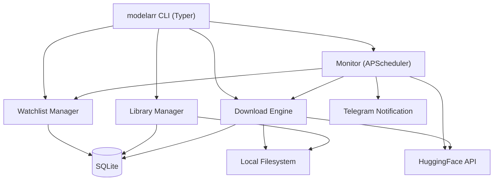

# modelarr

**Radarr/Sonarr for LLM models.** Monitors HuggingFace for new releases matching your watchlist and auto-downloads them to a local library.

Never miss a new model release again. Follow specific models, authors, search queries, or entire model families — modelarr checks HuggingFace on a schedule and downloads new matches automatically, with resume support, disk management, and Telegram notifications.


---

## Features

- **Smart Watchlist** — Follow specific models, authors, search queries, or model families with format/quantization filters
- **Auto-Download** — New models matching your watchlist are downloaded automatically via `huggingface_hub` with resume support
- **Format Detection** — Automatically identifies GGUF, MLX, safetensors, and PyTorch formats from filenames
- **Quantization Detection** — Extracts quantization level (Q4_K_M, 4bit, 8bit, fp16, bf16) from filenames
- **Storage Management** — Set disk limits and auto-prune oldest models when space runs low
- **Telegram Notifications** — Get pinged when new models are downloaded
- **Scheduled Monitoring** — Runs on a configurable interval with daemon mode and PID management
- **Local-First** — Everything stored in SQLite at `~/.config/modelarr/`. No cloud dependencies beyond HuggingFace.

---

## Installation

**Requirements:** Python 3.11+ and [uv](https://docs.astral.sh/uv/)

```bash
git clone https://github.com/SDS-Mike/modelarr.git
cd modelarr
uv sync
```

Verify:
```bash
uv run modelarr --version
# modelarr 0.1.0
```

---

## Quick Start

### 1. Add watches

```bash
# Watch a specific model for updates
modelarr watch add model mlx-community/Qwen3.5-27B-Claude-4.6-Opus-Distilled-MLX-4bit

# Watch everything an author releases, filtered to MLX 4-bit
modelarr watch add author Jackrong --format mlx --quant 4bit

# Watch a search query
modelarr watch add query "opus distilled MLX" --format mlx

# Watch an author with no filters (get everything)
modelarr watch add author Liquid4All
```

### 2. Configure

```bash
# Set where models are stored (required)
modelarr config set library_path ~/models

# Set disk limit (optional)
modelarr config set max_storage_gb 500

# Enable Telegram notifications (optional)
modelarr config set telegram_token <your-bot-token>
modelarr config set telegram_chat_id <your-chat-id>
```

### 3. Run

```bash
# One-off check — poll HuggingFace now and download any new matches
modelarr monitor check

# Start the scheduler (polls every 60 minutes by default)
modelarr monitor start

# Or run as a daemon
modelarr monitor start --daemon
```

---

## Watchlist


### Watch Types

| Type | What it does | Example |
|------|-------------|---------|
| `model` | Tracks a specific model repo for new commits | `modelarr watch add model mlx-community/Qwen3.5-27B-MLX-4bit` |
| `author` | Tracks all models by an author | `modelarr watch add author Jackrong --format mlx` |
| `query` | Searches HuggingFace for matching models | `modelarr watch add query "opus distilled" --format gguf` |
| `family` | Tracks a model family by name | `modelarr watch add family Qwen3.5 --quant 4bit` |

### Filters

All watch types support optional filters:

```bash
--format mlx          # Only MLX format models
--format gguf         # Only GGUF format models
--quant 4bit          # Only 4-bit quantized models
--quant Q4_K_M        # Specific quantization variant
--min-size 1000000    # Minimum size in bytes
--max-size 50000000000 # Maximum size in bytes
```

### Managing Watches

```bash
modelarr watch list              # Show all watches
modelarr watch list --enabled-only  # Show only enabled watches
modelarr watch toggle 2          # Disable/enable watch #2
modelarr watch remove 3          # Delete watch #3
```

---

## Library Management

```bash
# List all downloaded models
modelarr library list

# Show total disk usage
modelarr library size

# Remove a downloaded model
modelarr library remove mlx-community/Qwen3.5-27B-MLX-4bit

# Manual one-off download (bypasses watchlist)
modelarr download mlx-community/some-model

# Show download status
modelarr download status
```

---

## Monitor

```bash
# Single poll cycle
modelarr monitor check

# Start background scheduler (default: every 60 minutes)
modelarr monitor start
modelarr monitor start --interval 30    # Poll every 30 minutes
modelarr monitor start --daemon         # Run in background

# Check if monitor is running
modelarr monitor status

# Stop background monitor
modelarr monitor stop
```

---

## Configuration


```bash
modelarr config set <key> <value>
modelarr config show
```

| Key | Description | Default |
|-----|-------------|---------|
| `library_path` | Where to store downloaded models | `~/models` |
| `interval` | Poll interval in minutes | `60` |
| `telegram_token` | Telegram Bot API token | _(none)_ |
| `telegram_chat_id` | Telegram chat ID for notifications | _(none)_ |
| `max_storage_gb` | Maximum disk usage in GB | _(unlimited)_ |
| `auto_prune` | Auto-delete oldest models when over limit | `false` |
| `storage_auto_prune` | Alias for auto_prune | `false` |

All config stored in SQLite at `~/.config/modelarr/modelarr.db`.

---

## Architecture



### How the Monitor Works

```
Every N minutes:
  1. Load all enabled watchlist entries
  2. For each watch, query HuggingFace API:
     - model: check for new commits
     - author: list all models by author
     - query: search HuggingFace
     - family: search by family name
  3. Apply filters (format, quantization, size)
  4. Compare against known models in DB
  5. Download new matches via huggingface_hub
  6. Send Telegram notification for each download
  7. Check storage limits, prune if needed
```

---

## Development

```bash
# Install all dependencies (including dev tools)
uv sync

# Run tests (187 tests)
uv run pytest

# Lint
uv run ruff check src/ tests/

# Type check
uv run mypy src/
```

### Project Structure

```
src/modelarr/
├── cli.py          # Typer CLI with all command groups
├── db.py           # SQLite schema and connection management
├── models.py       # Pydantic models (WatchlistEntry, ModelRecord, etc.)
├── store.py        # CRUD operations for all entities
├── hf_client.py    # HuggingFace API client with format/quant detection
├── matcher.py      # Watchlist matching engine
├── downloader.py   # Download manager with resume support
├── monitor.py      # APScheduler-based polling monitor
├── notifier.py     # Telegram Bot API notifications
└── storage.py      # Disk limits and auto-prune
```

---

## License

MIT
